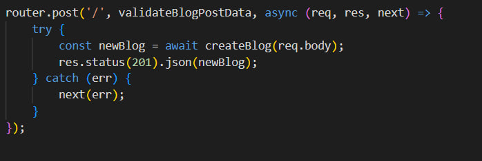
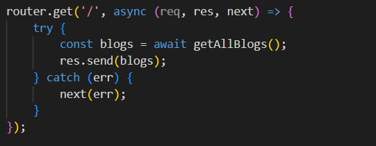
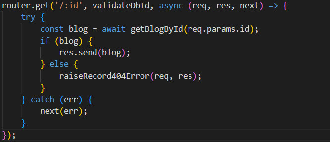
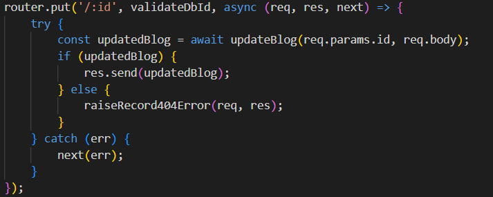
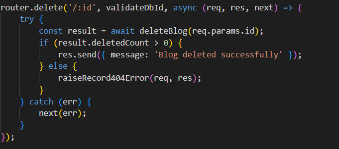
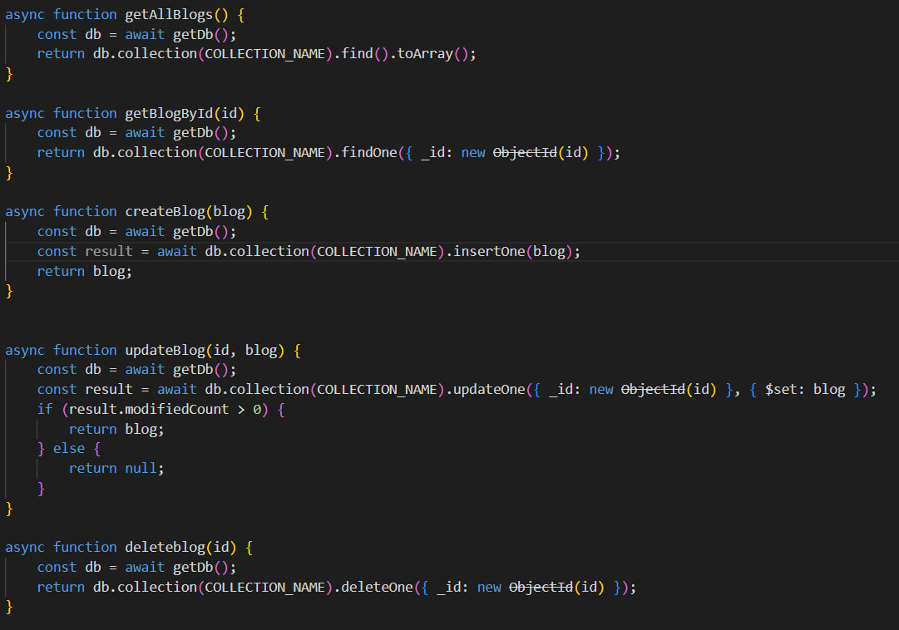
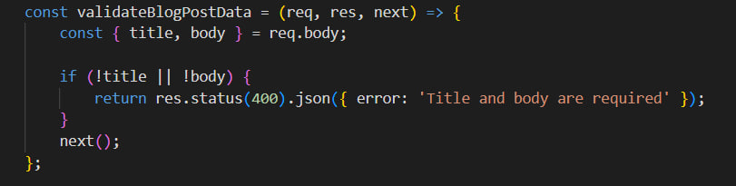
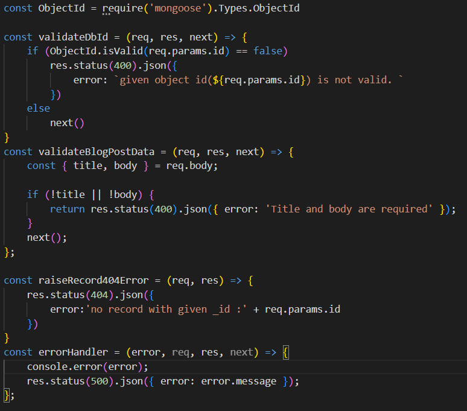
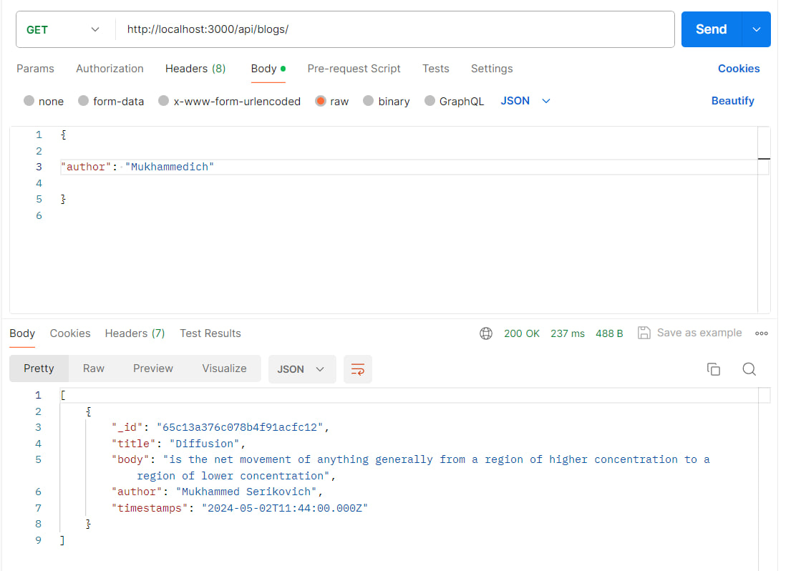

# Node.js and MongoDB CRUD API for Blogging Platform

This project implements a CRUD API for a simple blogging platform using Node.js and MongoDB.

## Setup and Initialization

1. **Node.js Project Setup**: Initialize a new Node.js project using npm.

2. **MongoDB Initialization**: Initialize a new MongoDB database for the application.

## API Endpoints

### Create

- **POST /api/blogs**: Create a new blog post.

### Read

- **GET /api/blogs**: Retrieve all blog posts.

- **GET /api/blogs/:id**: Retrieve a single blog post by ID.

### Update

- **PUT /api/blogs/:id**: Update a blog post by ID.

### Delete

- **DELETE /api/blogs/:id**: Delete a blog post by ID.

## Database

- Native MongoDB methods for database operations like find, insertOne, updateOne, deleteOne, etc. are used.
- Each post includes a title, body, author, and timestamps.

## Data Validation

- Data validation ensures that all blog post submissions contain a title and body.

## Error Handling

- Proper error handling is implemented for database errors and bad requests.
- Appropriate responses and HTTP status codes are returned.

## Testing

- Manually test the API using tools like Postman.
- Write automated tests to ensure all endpoints work as expected.

## Project Structure

- **db.js**: MongoDB database setup and connection.
- **middlewares.js**: Custom middleware functions for data validation and error handling.
- **services/blog.service.js**: Services for CRUD operations on the blog collection.
- **controllers/blog.controller.js**: Express router for handling blog-related routes.
- **models/Blog.js**: Mongoose model for the Blog collection.
- **index.js**: Main entry point of the application, sets up Express server and mounts routes.

## Running the Application

1. Clone the repository.
2. Install dependencies using `npm install`.
3. Start MongoDB server.
4. Run the application using `node index.js`.

## Authors

- Mukhammed Kaskyrbayev **SE-2210**

